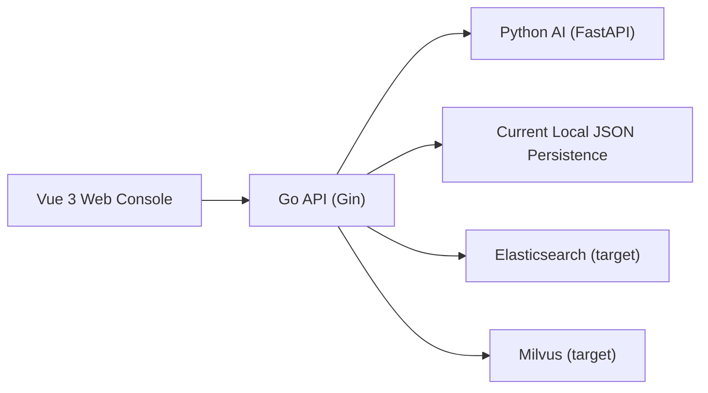

# AI OnCall

AI OnCall is a monorepo for an intelligent on-call platform with:

- `frontend/web`: Vue 3 web console
- `backend/go-api`: Go core business backend
- `backend/python-ai`: Python AI service
- `proto`: gRPC contracts reserved for Go/Python communication
- `deploy/docker-compose`: local and demo deployment assets
- `docs`: product, architecture, integration, and demo documents

## Core Capabilities

- Login and role-based access
- Session chat with SSE streaming reply
- Knowledge document management and retrieval testing
- Alert center with AI analysis and linked troubleshooting chat
- Tool center with execution logs
- Audit and operations insights page

## Architecture Snapshot



Project role split:

- `frontend/web`: user console and workflow pages
- `backend/go-api`: auth, sessions, knowledge, alerts, tools, audit, orchestration
- `backend/python-ai`: AI analysis boundary and future LangChain/LangGraph workflows

Current implementation tradeoff:

- Business flows are complete enough for demo and interview explanation
- Some persistence and AI abilities are still MVP-level and intentionally staged for later upgrades

## Local Development

Start infrastructure only:

```bash
./scripts/dev/up.sh
```

Start frontend, Go API, Python AI, and infrastructure together:

```bash
./scripts/dev/start-all.sh
```

Start services separately when needed:

```bash
./scripts/dev/web.sh
./scripts/dev/go-api.sh
./scripts/dev/python-ai.sh
```

OpenAI embedding configuration for real RAG:

```bash
cd backend/python-ai
cp .env.example .env
```

Then set at least:

```env
OPENAI_BASE_URL=https://api.openai.com/v1
OPENAI_API_KEY=your_openai_api_key
EMBEDDING_PROVIDER=openai_compatible
EMBEDDING_API_MODEL=text-embedding-3-small
EMBEDDING_DIMENSION=1536
```

## Demo Deployment

Start the demo stack with Docker Compose:

```bash
./scripts/demo/up.sh
```

Load demo data:

```bash
./scripts/demo/load-demo-data.sh
```

Stop the demo stack:

```bash
./scripts/demo/down.sh
```

Demo entry points:

- Web: `http://127.0.0.1:5173`
- Go API: `http://127.0.0.1:8080/healthz`
- Python AI: `http://127.0.0.1:8000/healthz`

Demo accounts:

- `admin / OnCallAdmin2026!`
- `ops / OnCallOps2026!`

## Verification

Backend tests:

```bash
cd backend/go-api
env GOPROXY=https://proxy.golang.org,direct \
  GOCACHE="$(pwd)/../../tmp/go-build" \
  GOMODCACHE="$(pwd)/../../tmp/go-mod-cache" \
  go test ./...
```

Frontend build:

```bash
cd frontend/web
npm run build
```

Python syntax check:

```bash
python3 -m compileall backend/python-ai/app
```

## Documents

- [Requirements](/Users/ouyangzhenguang/project/OnCall/docs/requirements.md)
- [Module Design](/Users/ouyangzhenguang/project/OnCall/docs/module-design.md)
- [System Architecture](/Users/ouyangzhenguang/project/OnCall/docs/system-architecture.md)
- [Development Plan](/Users/ouyangzhenguang/project/OnCall/docs/development-plan.md)
- [Database Design](/Users/ouyangzhenguang/project/OnCall/docs/database-design.md)
- [API Design](/Users/ouyangzhenguang/project/OnCall/docs/api-design.md)
- [Architecture Diagrams](/Users/ouyangzhenguang/project/OnCall/docs/architecture-diagrams.md)
- [Phase 12 Integration](/Users/ouyangzhenguang/project/OnCall/docs/phase-12-integration.md)
- [Phase 13 Demo](/Users/ouyangzhenguang/project/OnCall/docs/phase-13-demo.md)
- [Phase 14 Showcase](/Users/ouyangzhenguang/project/OnCall/docs/phase-14-showcase.md)

## Why This Project Is Worth Showing

- It is a full-stack system, not a single-page demo.
- It has clear business and AI service boundaries, which makes the architecture easy to explain.
- It covers the main on-call workflow: alert -> analysis -> linked session -> knowledge/tool support -> audit trail.
- It has both engineering assets and showcase assets: integration tests, Docker demo stack, diagrams, API doc, and interview talking points.

## Notes

- Python AI currently uses FastAPI plus a prompt/rule-based analysis service. Real model inference can be added later without changing the business API shape.
- Go startup scripts force `GOPROXY=https://proxy.golang.org,direct` by default and use project-local caches under `tmp/`.
- The demo environment targets “fast startup and clear walkthrough”, not production deployment.
