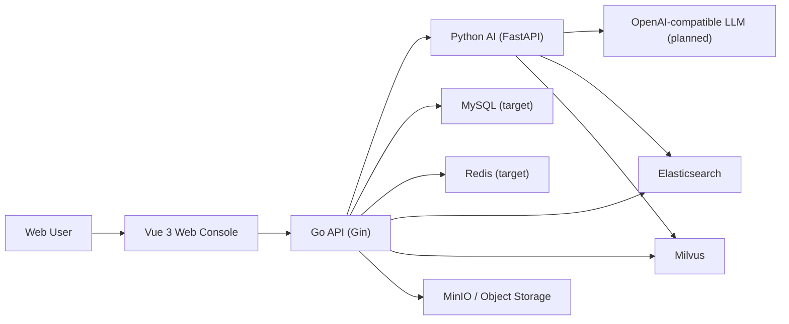
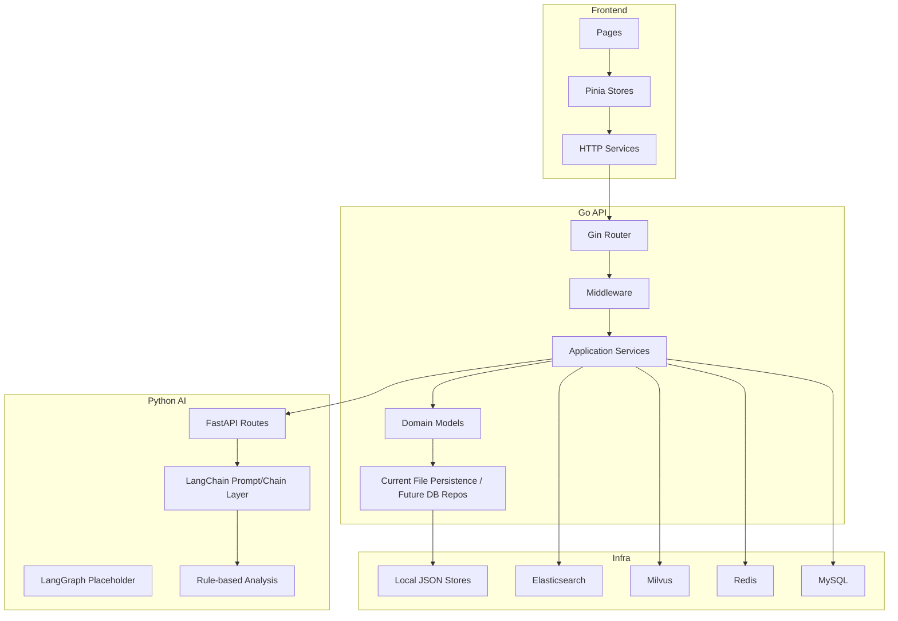
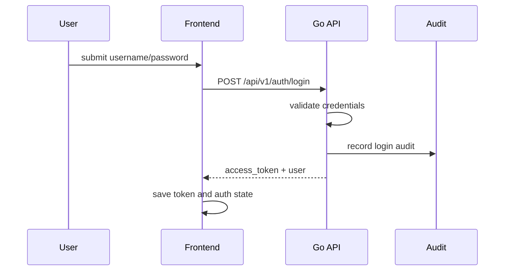
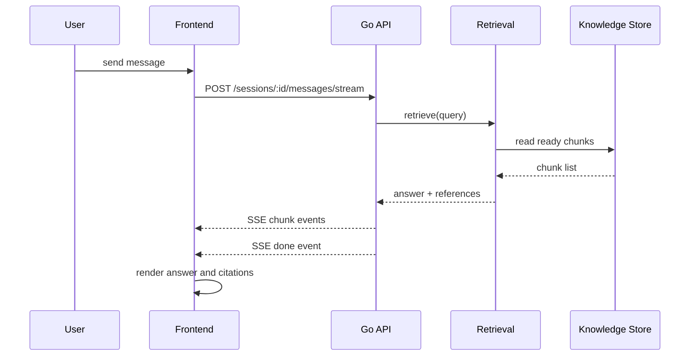
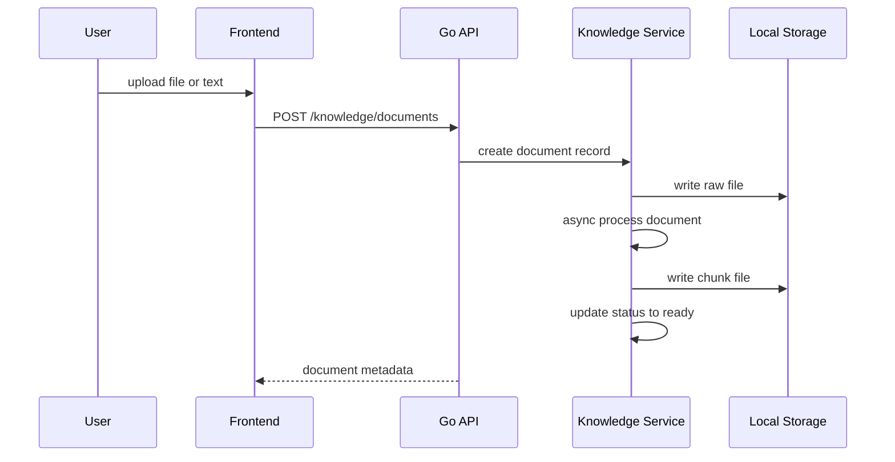
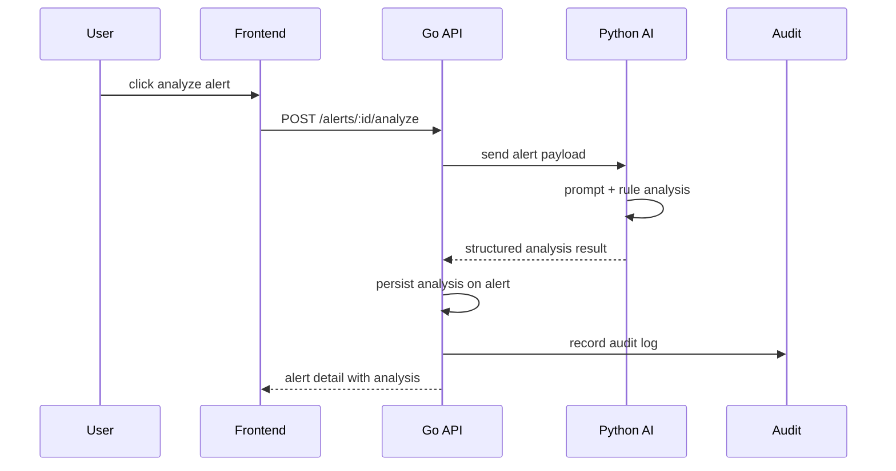
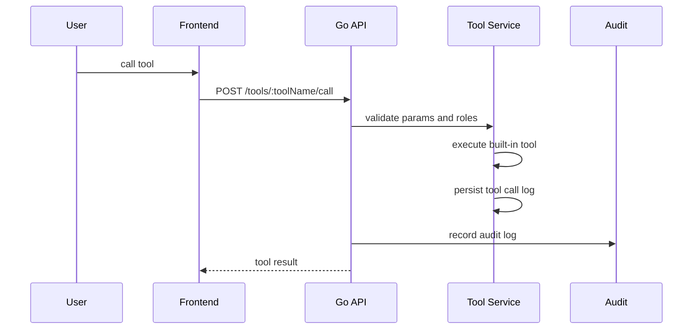

# AI OnCall Architecture Diagrams

## 1. System Context

## 2. Current Layered Architecture

## 3. Login Flow

## 4. Chat and Retrieval Flow

## 5. Knowledge Ingestion Flow

## 6. Alert Analysis Flow

## 7. Tool Invocation Flow

## 8. Architecture Notes

- Current persistence is file-backed for speed of iteration.
- The target architecture is still `Vue + Go API + Python AI + MySQL + Redis + Elasticsearch + Milvus`.
- Go is the business orchestration center.
- Python AI is the AI capability service boundary.
- Search and vector infrastructure are designed as retrievable side systems, not the source of truth.
