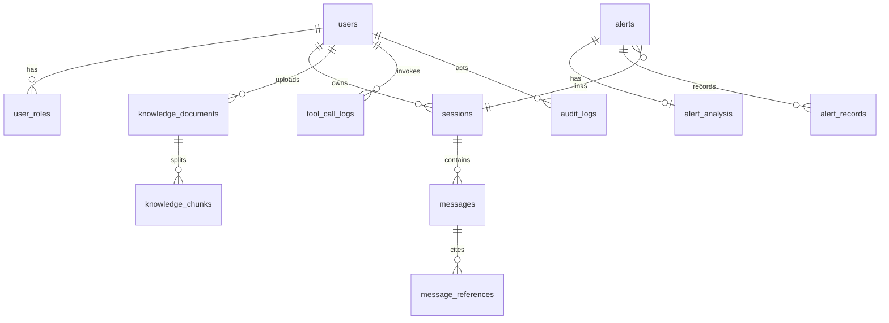

# AI OnCall Database Design

## 1. Purpose

This document defines the target transactional data model for AI OnCall and clarifies the gap between the current MVP implementation and the target MySQL-based design.

Current implementation status:

- Auth/users/roles: MySQL source of truth
- Sessions/messages: MySQL source of truth
- Knowledge metadata/chunks: MySQL source of truth
- Alerts/handling records: MySQL source of truth
- Tool call logs: MySQL source of truth
- Audit logs: MySQL source of truth
- Raw knowledge files: local disk under `tmp/knowledge/documents`

Current persistence architecture:

- MySQL: transactional session, knowledge, and alert data
- Redis: hot session cache, rate limiting, short-lived state
- Elasticsearch: keyword retrieval index
- Milvus: vector retrieval index
- MinIO or object storage: raw document files

Still pending:

- Replace local raw-file storage with MinIO or object storage

## 2. Design Principles

- Business source of truth stays in MySQL.
- Search and vector stores are derived data, not source of truth.
- High-volume append-only records use independent tables and time-based indexes.
- Session, knowledge, alert, tool, and audit domains remain separately modeled.
- Fields needed for resume-level system design explanation are kept explicit rather than hidden in blobs.

## 3. Core Tables

### 3.1 users

Purpose:

- User identity, display info, login control

Suggested fields:

| Column | Type | Notes |
| --- | --- | --- |
| id | bigint unsigned pk | snowflake or auto-increment |
| username | varchar(64) unique | login identifier |
| password_hash | varchar(255) | bcrypt/argon2 hash |
| display_name | varchar(64) | UI display name |
| status | tinyint | enabled, disabled |
| created_at | datetime | creation time |
| updated_at | datetime | update time |

### 3.2 user_roles

Purpose:

- RBAC role binding

Suggested fields:

| Column | Type | Notes |
| --- | --- | --- |
| id | bigint unsigned pk | |
| user_id | bigint unsigned | fk to users.id |
| role_code | varchar(32) | admin, ops, developer |
| created_at | datetime | |

Indexes:

- unique `(user_id, role_code)`

### 3.3 sessions

Purpose:

- Conversation metadata

Mapped from current struct:

- `id`
- `user_id`
- `title`
- `last_message_preview`
- `message_count`
- `last_message_at`
- `created_at`
- `updated_at`

Suggested fields:

| Column | Type | Notes |
| --- | --- | --- |
| id | varchar(64) pk | keep string id for easy migration |
| user_id | bigint unsigned | session owner |
| title | varchar(255) | user title or generated title |
| summary | text | later phase summary compression result |
| last_message_preview | varchar(512) | list page display |
| message_count | int unsigned | denormalized counter |
| last_message_at | datetime | sort key |
| source | varchar(32) | manual, alert_linked |
| created_at | datetime | |
| updated_at | datetime | |

Indexes:

- `(user_id, last_message_at desc)`
- `(user_id, updated_at desc)`

### 3.4 messages

Purpose:

- Per-session message history

Mapped from current struct:

- `id`
- `session_id`
- `role`
- `content`
- `status`
- `created_at`

Suggested fields:

| Column | Type | Notes |
| --- | --- | --- |
| id | varchar(64) pk | |
| session_id | varchar(64) | fk to sessions.id |
| role | varchar(16) | user, assistant, tool, system |
| content | longtext | raw text content |
| status | varchar(16) | streaming, completed, failed |
| token_count | int unsigned | optional later |
| created_at | datetime | |

Indexes:

- `(session_id, created_at desc)`
- `(session_id, id desc)`

### 3.5 message_references

Purpose:

- Structured citation records attached to assistant messages

Mapped from current reference struct:

- `document_id`
- `document_title`
- `category`
- `excerpt`
- `score`

Suggested fields:

| Column | Type | Notes |
| --- | --- | --- |
| id | bigint unsigned pk | |
| message_id | varchar(64) | fk to messages.id |
| document_id | varchar(64) | knowledge document id |
| document_title | varchar(255) | snapshot title |
| category | varchar(64) | snapshot category |
| excerpt | text | cited chunk text |
| score | decimal(10,4) | retrieval score |
| created_at | datetime | |

Indexes:

- `(message_id)`
- `(document_id)`

### 3.6 knowledge_documents

Purpose:

- Knowledge document metadata

Mapped from current struct:

- `id`
- `user_id`
- `title`
- `category`
- `source_type`
- `file_name`
- `content_type`
- `storage_path`
- `size_bytes`
- `status`
- `summary`
- `text_preview`
- `chunk_previews`
- `failure_reason`
- `chunk_count`
- `processed_at`
- `created_at`
- `updated_at`

Suggested fields:

| Column | Type | Notes |
| --- | --- | --- |
| id | varchar(64) pk | |
| user_id | bigint unsigned | uploader |
| title | varchar(255) | document title |
| category | varchar(64) | runbook, postmortem, faq |
| source_type | varchar(16) | file, text |
| file_name | varchar(255) | original file name |
| content_type | varchar(128) | mime type |
| object_key | varchar(512) | object storage key |
| size_bytes | bigint unsigned | file size |
| status | varchar(16) | uploaded, processing, ready, failed |
| summary | text | display summary |
| text_preview | text | preview |
| failure_reason | varchar(512) | processing error |
| chunk_count | int unsigned | chunk count |
| processed_at | datetime null | processing finished time |
| created_at | datetime | |
| updated_at | datetime | |

Indexes:

- `(user_id, updated_at desc)`
- `(status, updated_at desc)`
- `(category, updated_at desc)`

### 3.7 knowledge_chunks

Purpose:

- Structured chunks used for retrieval and index sync

Mapped from current chunk model:

- `document_id`
- `document_title`
- `category`
- `index`
- `content`

Suggested fields:

| Column | Type | Notes |
| --- | --- | --- |
| id | bigint unsigned pk | |
| document_id | varchar(64) | fk to knowledge_documents.id |
| chunk_index | int unsigned | stable order |
| content | text | chunk content |
| token_count | int unsigned | optional |
| es_doc_id | varchar(128) | Elasticsearch doc id |
| milvus_point_id | varchar(128) | vector point id |
| created_at | datetime | |
| updated_at | datetime | |

Indexes:

- unique `(document_id, chunk_index)`
- `(document_id)`

### 3.8 alerts

Purpose:

- Alert master data and AI analysis snapshot

Mapped from current struct:

- `id`
- `title`
- `service`
- `environment`
- `severity`
- `source`
- `status`
- `summary`
- `description`
- `labels`
- `linked_session_id`
- `occurrence_count`
- `triggered_at`
- `last_triggered_at`
- `created_at`
- `updated_at`

Suggested fields:

| Column | Type | Notes |
| --- | --- | --- |
| id | varchar(64) pk | |
| title | varchar(255) | alert title |
| service | varchar(128) | service name |
| environment | varchar(32) | prod, staging |
| severity | varchar(16) | P1, P2 |
| source | varchar(64) | grafana, prometheus |
| status | varchar(16) | open, acknowledged, investigating, resolved |
| summary | text | short summary |
| description | text | detail |
| labels_json | json | source labels |
| linked_session_id | varchar(64) null | troubleshooting session |
| occurrence_count | int unsigned | dedupe count |
| triggered_at | datetime | first trigger |
| last_triggered_at | datetime | latest trigger |
| created_at | datetime | |
| updated_at | datetime | |

Indexes:

- `(service, environment, status, last_triggered_at desc)`
- `(severity, status, last_triggered_at desc)`
- `(linked_session_id)`

### 3.9 alert_analysis

Purpose:

- Separate table for structured AI analysis result

Mapped from current nested struct:

- `status`
- `summary`
- `severity_assessment`
- `possible_causes`
- `suggested_actions`
- `recommended_tools`
- `knowledge_queries`
- `workflow`
- `confidence`
- `source`
- `generated_at`
- `error`

Suggested fields:

| Column | Type | Notes |
| --- | --- | --- |
| id | bigint unsigned pk | |
| alert_id | varchar(64) | fk to alerts.id |
| status | varchar(16) | success, failed |
| summary | text | structured summary |
| severity_assessment | text | severity interpretation |
| possible_causes_json | json | array |
| suggested_actions_json | json | array |
| recommended_tools_json | json | array |
| knowledge_queries_json | json | array |
| workflow | varchar(64) | workflow name |
| confidence | varchar(16) | low, medium, high |
| source | varchar(64) | python-ai, llm |
| error | text | failure message |
| generated_at | datetime | |
| created_at | datetime | |

Indexes:

- unique `(alert_id)`

### 3.10 alert_records

Purpose:

- Alert handling timeline

Suggested fields:

| Column | Type | Notes |
| --- | --- | --- |
| id | varchar(64) pk | |
| alert_id | varchar(64) | fk to alerts.id |
| action | varchar(32) | status_change, link_session, analyze |
| operator | varchar(64) | display operator |
| comment | text | timeline content |
| created_at | datetime | |

Indexes:

- `(alert_id, created_at desc)`

### 3.11 tool_call_logs

Purpose:

- Tool execution records

Mapped from current struct:

- `id`
- `tool_name`
- `operator`
- `user_id`
- `status`
- `input`
- `output`
- `error`
- `duration_ms`
- `created_at`

Suggested fields:

| Column | Type | Notes |
| --- | --- | --- |
| id | varchar(64) pk | |
| tool_name | varchar(64) | logical tool name |
| operator | varchar(64) | snapshot operator |
| user_id | bigint unsigned | caller |
| status | varchar(16) | success, failed, forbidden |
| input_json | json | normalized parameters |
| output_json | json | execution result |
| error | text | failure reason |
| duration_ms | bigint unsigned | execution latency |
| created_at | datetime | |

Indexes:

- `(tool_name, created_at desc)`
- `(status, created_at desc)`
- `(user_id, created_at desc)`

### 3.12 audit_logs

Purpose:

- Cross-domain audit trail

Mapped from current struct:

- `id`
- `category`
- `action`
- `status`
- `actor_id`
- `actor_name`
- `actor_roles`
- `target_type`
- `target_id`
- `target_name`
- `detail`
- `metadata`
- `created_at`

Suggested fields:

| Column | Type | Notes |
| --- | --- | --- |
| id | varchar(64) pk | |
| category | varchar(32) | auth, session, knowledge, alert, tool |
| action | varchar(64) | login, upload, analyze |
| status | varchar(16) | success, failed |
| actor_id | varchar(64) | user id |
| actor_name | varchar(64) | snapshot name |
| actor_roles_json | json | role array |
| target_type | varchar(32) | alert, document, session |
| target_id | varchar(64) | business target |
| target_name | varchar(255) | snapshot title |
| detail | text | human-readable detail |
| metadata_json | json | extra context |
| created_at | datetime | |

Indexes:

- `(category, created_at desc)`
- `(action, created_at desc)`
- `(status, created_at desc)`
- `(actor_id, created_at desc)`

## 4. Suggested Relations

## 5. Storage Evolution Plan

### Current MVP

- File-backed JSON persistence for fast iteration
- Good for local demo, bad for concurrency and operational durability

### Mid-term

- Move sessions, messages, knowledge metadata, alerts, tool logs, and audit logs into MySQL
- Keep raw files in local disk or MinIO

### Target

- MySQL as business source of truth
- Redis for session hot cache and rate limiting
- Elasticsearch for keyword retrieval
- Milvus for vector retrieval
- MinIO for file storage

## 6. Migration Priority

Recommended order:

1. `sessions` and `messages`
2. `knowledge_documents` and `knowledge_chunks`
3. `alerts`, `alert_records`, and `alert_analysis`
4. `tool_call_logs`
5. `audit_logs`
6. `users` and `user_roles` (completed)

Reason:

- Session and knowledge data are closest to the core interaction loop.
- Alert, tool, and audit data already have stable domain shape.
- Auth is now persisted in MySQL, but still uses seeded demo users rather than a full user-management flow.

## 7. Known Gaps

- Current code does not yet use GORM repositories for these tables.
- No SQL migrations have been added yet.
- Some list pages still assume full in-memory list rather than database pagination.
- `summary` for sessions is planned but not generated yet.
- `knowledge_chunks` currently come from text chunking only, not a full parser pipeline.
- Raw knowledge files still live on local disk instead of MinIO/object storage.
