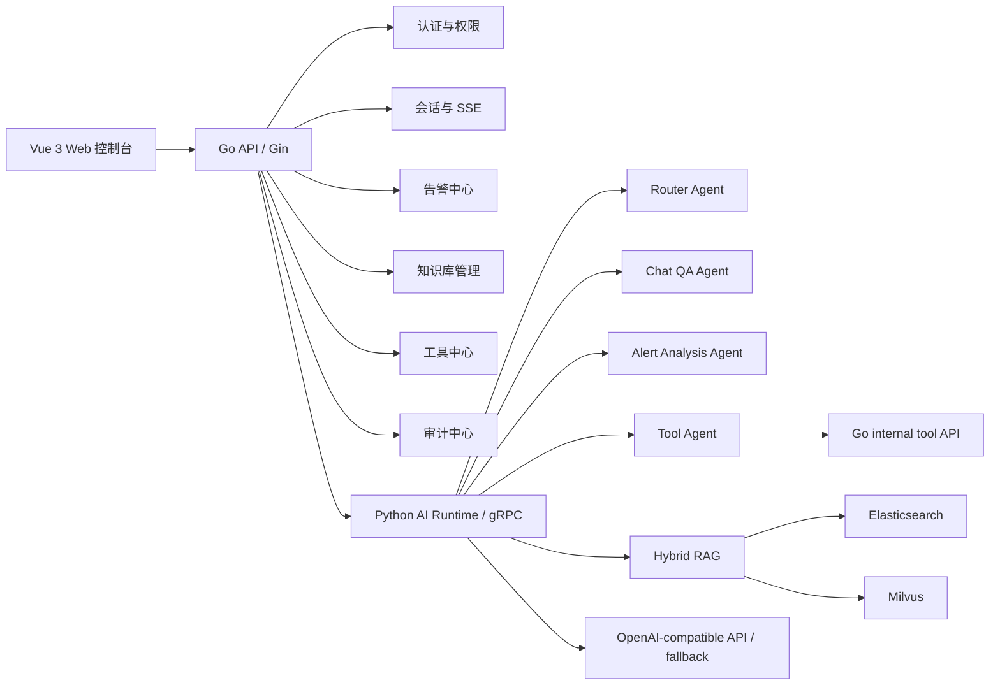

# AI OnCall 智能值班协作平台 - AI 应用工程师面试备答

适用场景：面试官来自“一起找好房”，岗位是 AI 应用工程师，重点考察 AI 应用落地、业务链路接入、工程稳定性、可观测性、成本意识，以及候选人是否真正主导过项目。

这份文档的口径很重要：不要把当前项目说成大规模生产系统。更稳妥的说法是：

- 这是 2026.01 - 2026.03 主导实现的全栈 AI 应用项目。
- 项目覆盖“告警接入 -> AI 分析 -> 对话排障 -> RAG 检索 -> 工具调用 -> 审计留痕 -> Docker Compose 演示部署”的完整链路。
- 当前更偏 MVP / 演示级落地，已经具备业务闭环、集成测试、可观测字段和降级策略，但还没有真实线上流量指标。
- 面试中可以强调工程边界和真实取舍，不要夸大为“生产级多租户智能运维平台”。

相关代码入口：

- Go 路由装配：`backend/go-api/internal/platform/httpserver/server.go`
- 会话与 SSE：`backend/go-api/internal/session/api/handler.go`
- 知识库切片：`backend/go-api/internal/knowledge/application/service.go`
- 工具注册与调用：`backend/go-api/internal/tool/application/service.go`
- Python AI runtime：`backend/python-ai/app/grpc/services/runtime_service.py`
- RAG 混合检索：`backend/python-ai/app/services/hybrid_rag.py`
- 告警 Agent：`backend/python-ai/app/agents/alert_analysis_agent.py`
- 对话 Agent：`backend/python-ai/app/agents/chat_qa_agent.py`
- 工具 Agent：`backend/python-ai/app/agents/tool_agent.py`

## 0. 先给面试官的 3 分钟版本

这个项目解决的是研发、测试、运维和值班人员在故障响应中“信息分散、知识复用低、排障过程不可追溯”的问题。我做的是一套 AI 驱动的智能值班协作平台，把告警、会话、知识库、RAG、工具调用和审计串成一个闭环。

整体架构是 Vue 3 前端、Go 业务后端和 Python AI 服务三层。Go 负责登录鉴权、会话、告警、知识库、工具中心、审计和 SSE；Python 负责大模型调用、LangGraph 工作流、RAG 检索和工具编排；两者通过 gRPC 和少量 HTTP 接口协作。基础设施用 MySQL、Redis、Elasticsearch、Milvus、MinIO 等，Docker Compose 支持本地演示。

AI 真正产生价值的地方不是“问答页面”，而是故障响应链路：告警进入平台后，可以生成结构化分析，推荐排查方向，关联排障会话；会话中可以结合历史消息、知识库引用和只读工具结果继续追问；工具调用和模型行为会写入审计和 trace，方便复盘。RAG 不是只接一个向量库，而是做了文档上传、文本切片、Embedding、ES 词法召回、Milvus 语义召回、本地兜底、融合排序和引用展示。

如果把经验迁移到找房业务，我会优先做内部经纪人/客服知识助手，而不是一上来做完全开放的 C 端购房顾问。原因是房产政策、税费、学区等高风险信息时效性强，内部助手更容易接入权威知识源、做引用约束、人工兜底和效果评估，先把成交/咨询链路中的高频问题提效跑通。

## 1. 项目真实性与架构

### 1. 你先用 3 分钟讲一下这个项目

答法：

- 核心问题：值班场景中告警、知识文档、排障会话和工具执行是割裂的，AI 只做问答价值有限，所以我把 AI 放进故障响应链路。
- 目标用户：研发看服务告警和上下文，测试/运维查排障知识和值班记录，值班负责人看审计、工具调用和处理时间线。
- 我的职责：整体架构设计、前端核心页面、Go 业务后端、Python AI runtime、RAG、工具中心、告警分析、审计、Docker Compose 演示链路。
- 技术含量：不是 CRUD，而是把 RAG、Agent、工具调用、SSE、审计和告警状态流转接到一条可演示、可追踪的业务链路里。

### 2. 你说负责整体架构设计与核心功能开发，画一下系统架构

可以这样画：

请求流：

- 普通页面数据：前端 -> Go REST API -> MySQL 或本地 JSON fallback。
- 会话问答：前端 -> Go 创建 user/assistant message -> Go 调 Python gRPC -> Go 把完整回答切成 SSE chunk 推回前端 -> Go 完成消息落库。
- 告警分析：前端 -> Go 告警接口 -> Python gRPC AnalyzeAlert -> RAG/工具/结构化输出 -> Go 写回告警分析和处理记录。
- 知识入库：前端上传 -> Go 保存文档和切片 -> Go 调 Python RAG index -> Python 写 ES/Milvus，失败时回退本地索引状态。

状态型模块：

- MySQL/本地 JSON 中的会话、消息、告警、知识文档、工具日志、审计日志。
- ES/Milvus 中的索引。

无状态或尽量无状态模块：

- Go HTTP handler、中间件、AI gateway。
- Python Agent 工作流本身，除了 RAG 服务中有本地兜底 chunk 缓存。

### 3. 最难的一次技术决策是什么

可以讲“Go 业务后端 + Python AI runtime 的边界”。

备选方案：

- 全部放 Go：工程统一，但 AI 生态接 LangGraph、RAG、Embedding、Milvus 会更费力。
- 全部放 Python：AI 快，但登录、告警、审计、工具、权限这些后端工程能力不如 Go 项目展示清晰。
- Go 做业务主链路，Python 做 AI runtime：边界更清楚，成本是多语言和跨服务通信复杂度上升。

最终选择第三种：Go 保持业务可信边界，Python 承接模型、RAG 和 Agent 工作流。Go 只通过 gateway 调用稳定业务接口，不直接依赖 Python 内部 graph。这个选择也符合 AI 应用工程师岗位：要能把 AI 能力接进业务，而不是把业务都交给模型。

### 4. 如果重新做一遍，会推翻哪三处设计

可以如实说：

1. 会话流式链路：当前 Python 侧是一次性生成完整回答，Go 再按 18 个 rune 切成 SSE chunk。重新做会让 Python runtime 支持真正 token streaming，Go 只做透传、审计和状态维护。
2. RAG 切片策略：当前是 320 字符、60 overlap 的固定窗口。重新做会按 Markdown 标题、日志块、FAQ 问答、代码块做结构化切分，再保留固定窗口兜底。
3. 工具策略：当前工具都是只读工具，选择逻辑偏规则。重新做会把工具注册、风险分级、确认策略、超时、重试和幂等能力配置化，支持更复杂的多工具链。

## 2. 大模型接入与对话能力

### 5. 你们接的是哪类模型，为什么选它

当前接的是 OpenAI-compatible API，配置在 `backend/python-ai/app/core/config.py`，默认模型名是 `gpt-4.1-mini`，也支持没有 API key 时走确定性 fallback，保证本地开发和测试不断。

选型关注：

- API 兼容性：OpenAI-compatible 方便替换供应商。
- 成本和时延：运维问答不是每次都需要最强推理模型，默认选择偏轻量模型。
- 结构化输出能力：告警分析需要 JSON 字段，例如 summary、possible_causes、suggested_actions。
- 中文和中英混合能力：运维文档里会同时出现中文描述、服务名、指标名、错误码。

没有做正式线上 AB 测试，可以说做了“可替换设计”和“fallback 测试”，但不要说做过生产 AB。

### 6. 多轮上下文怎么管理

项目里上下文管理分两层：

- Go 会话服务保存完整历史消息，支持列表、分页、状态和引用。
- 发起聊天时 Go 取最近 8 条消息传给 Python；Python `ChatQAAgent` 再取最近 4 条参与 prompt。

这么做是为了控制上下文长度和调用成本。当前没有做摘要压缩，适合演示和短会话。重构方向是：

- 保留最近若干轮原文。
- 对更早历史做摘要。
- 对告警关联会话保留 service、environment、severity、linked_alert、已调用工具、结论和未解决事项。
- 普通寒暄、重复确认、低信息量内容可以裁剪。

### 7. SSE 流式回复怎么实现

当前实现：

- 前端用 `fetch` 读取 response body stream，解析 `event: chunk` 和 `event: done`。
- Go 在 `StreamMessage` 中先创建 user message 和 streaming 状态的 assistant message。
- Go 调 Python runtime 拿到完整回答后，用 `splitReplyChunks(content, 18)` 切片，每 60ms 写一个 SSE chunk。
- 完成后 Go 把 assistant message 状态更新为 completed，并保存 route、tool calls、trace、references。

需要如实说明：当前不是模型 token 级 streaming，是 Go 侧模拟流式分片。它解决了前端交互体验和消息状态闭环，但真正生产化应该改成 Python 模型流式输出 -> Go 透传 -> 前端增量渲染。

断流和恢复：

- 目前写入前会先创建 assistant message，完成后更新为 completed。
- 如果中途失败，当前失败状态处理还可以增强，例如标记 failed、支持重试和恢复未完成消息。

### 8. prompt 怎么针对告警分析优化输出

当前告警分析 prompt 要求模型返回 JSON，字段包括：

- summary
- severity_assessment
- possible_causes
- suggested_actions
- recommended_tools
- knowledge_queries

输入会包含 service、environment、severity、title、summary、description、labels、fallback 结构和 RAG snippets。

面试答法：

- 我没有让模型自由发挥，而是给它结构化字段。
- 告警分析先有规则 fallback，再用模型补充，模型输出解析失败会回退 fallback。
- suggested_actions 会合并 RAG 引用建议和工具执行结果，避免只给泛泛的排查话术。

改进方向：

- 把 prompt 模板配置化。
- 对 P0/P1 增加更严格的输出约束和升级建议。
- 加入“必须引用 runbook 或工具结果，否则降低置信度”的规则。

### 9. 模型幻觉怎么控制

当前项目已经做的：

- RAG 引用：回答返回 citation/reference，前端可以展示来源。
- 工具优先：服务状态、近期告警、知识检索通过工具拿真实系统数据。
- 结构化输出：告警分析使用固定字段。
- fallback：OpenAI API 不可用时有确定性 fallback，不让链路直接崩。
- trace：返回 router/rag/tool/chat_qa/alert_analysis 等阶段信息，便于定位。

当前还需要加强的：

- 高风险结论必须引用知识库或工具结果。
- 不确定时明确说“不足以判断”，而不是强答。
- 对 prompt injection、知识库投毒和越权引用做更严格拦截。
- 对删除类、写入类工具引入人工确认和审批。

## 3. RAG 与知识库能力

### 10. RAG 链路具体怎么做

链路如下：

1. 用户上传文本类文档或直接输入文本。
2. Go 保存文档元数据和原始内容。
3. Go 对文本做基础切片，当前是 320 字符 chunk、60 字符 overlap。
4. Go 把 chunk 通过 HTTP 调给 Python `/api/v1/rag/index`。
5. Python 生成 embedding，优先 OpenAI-compatible embedding API，其次本地 SentenceTransformer，最后 hash fallback。
6. Python 写 Elasticsearch 做词法检索，写 Milvus 做向量检索。
7. 查询时 Python 做 query plan，包括 normalized、terms、expanded_terms、char_terms、rewritten_query。
8. ES 和 Milvus 双路召回，各取 `limit * 4` 候选。
9. 用融合排序、boost、相邻 chunk 拼接和阈值过滤得到 references。
10. 最终返回 answer、references、scanned_docs、lexical_candidates、semantic_candidates、strategy、backend 等诊断字段。

### 11. 切片策略怎么定

当前实现是固定窗口：

- chunk size：320 字符。
- overlap：60 字符。
- 只支持文本类文档基础预处理，例如 txt、md、log、json、yaml 等。

为什么这么做：

- MVP 阶段优先让链路跑通，保证上传、切片、索引、检索、引用展示闭环。
- 固定窗口简单稳定，便于测试和演示。

不足：

- 对 Markdown 标题、表格、代码块、FAQ 结构不够友好。
- 日志和 runbook 更适合按段落、标题、错误码和步骤切。

面试中可以主动说后续会做结构化切片，而不是假装当前已经做了语义切分。

### 12. 检索效果怎么评估

当前已有 `backend/python-ai/tests/test_rag_eval_cases.py` 这类测试，能验证一些典型检索案例。但没有真实线上指标。

面试答法：

- 当前阶段我主要做了离线 case 和诊断字段：看 query rewrite、候选数、命中片段、match reasons、strategy。
- 如果上线，会补一个小型评估集，字段包括 query、期望 document/chunk、可接受答案要点。
- 指标会看 hit@k、MRR、无引用回答率、人工追问率、采纳率、问题解决率。
- 对房产场景还会按城市、政策类型、时效性做分层评估。

### 13. 为什么展示引用来源，怎么做引用对齐

引用不是 UI 装饰，主要价值是可信度和可追溯性。项目中引用来自 RAG 返回的 `RAGReference` 或 gRPC citation，包含 document_id、document_title、category、chunk/snippet、score。

对齐方式：

- 检索阶段返回 chunk 级引用。
- Chat QA prompt 把 citation snippet 拼入模型输入。
- 最终 response 再把 citation_items 传回 Go，Go 映射为会话 message references。

当前不是逐句答案到引用的精确 attribution，而是“回答基于这些 chunk”。如果面试官追问，要如实说明精确引用对齐还可以增强，例如让模型每条结论标注引用编号。

### 14. 文档质量差、版本不一致、内容过期怎么办

当前项目做了基础元数据和 category 过滤，还没有完整治理体系。

生产化设计：

- 文档元数据：source、owner、city、business_line、version、effective_date、expired_at。
- 增量更新：文档更新后删除旧 chunk 索引再写新索引。
- 去重：按 document hash 和 chunk hash 去重。
- 过期治理：过期文档降权、隐藏或强制下架。
- 权限隔离：检索前按用户权限和文档元数据过滤，不能只在检索后过滤。
- 质量评分：空泛、过短、无来源、过期的文档降低权重。

### 15. 为什么选 RAG 而不是微调

原因：

- 业务知识变化快，RAG 更新文档比重新微调快。
- 故障 SOP、房产政策、税费规则都需要可追溯引用，RAG 更容易解释。
- 项目阶段数据规模不大，不值得先做领域微调。
- 微调更适合学习风格或稳定任务模式，不适合承载频繁变更的事实知识。

可以补一句：如果以后有大量高质量标注数据，可以考虑用微调优化意图识别、结构化抽取或话术风格，但事实知识仍然优先走 RAG。

## 4. 工具调用与 Agent 能力

### 16. 统一工具调用机制是 function calling 还是自定义协议

当前是自定义协议，不是 OpenAI function calling。

实现方式：

- Go 侧 `ToolService` 注册工具 schema，包括 name、display_name、description、category、allowed_roles、parameters。
- 当前工具包括 `service_status`、`recent_alerts`、`knowledge_search`、`platform_overview`。
- Python `ToolAgent` 根据消息和 allowed_tools 选择工具，构造参数。
- Python 通过 `GoToolGateway` 调 Go 的 `/internal/ai/tools/:toolName/call`。
- 内部调用用 `X-OnCall-Runtime-Secret` 做 runtime secret 校验。
- Go 再做角色校验、参数校验、执行和日志记录。

### 17. 模型决定调用哪个工具，还是规则决定

当前偏规则和白名单：

- Go 调聊天 runtime 时传 allowed_tools，例如 `knowledge_search`、`service_status`。
- ToolAgent 根据关键词和 allowed_tools 选择工具。
- 告警分析会根据 severity 和告警文本推荐工具，例如 service_status、recent_alerts、knowledge_search，P0/P1 可能加 platform_overview。

面试答法：

- 我没有把工具选择完全交给模型。
- 模型可以参与建议，但最终可执行工具必须在 Go 侧注册、白名单、角色校验和参数校验后才能执行。
- 高风险工具不能只靠 prompt 限制。

### 18. 工具调用失败怎么办

当前实现：

- Python 捕获工具网关异常，把结果标记 failed，并写 trace。
- Go 工具服务记录 failed/forbidden/success 的 call log。
- 参数校验失败返回 BAD_REQUEST。
- 权限不足返回 forbidden。

生产化增强：

- 区分可重试错误和不可重试错误。
- 对外部依赖工具设置超时、熔断、重试次数和退避。
- 写操作工具加幂等 key。
- 工具结果过慢时降级为“已提交查询，稍后回看结果”。

### 19. 有没有做多工具串联

当前有轻量串联，不是复杂自主 Agent：

- 告警分析里最多执行推荐工具的前两个。
- 典型链路是先做 RAG，再执行 service_status/recent_alerts/knowledge_search，再把结果合并到 suggested_actions。

没有做开放式长链路规划。面试中可以说：

- 我刻意限制工具链长度，避免延迟和失败率不可控。
- 如果要做多工具串联，会用显式 workflow：查告警详情 -> 查服务状态 -> 查近期告警 -> 查知识库 -> 生成建议，每步有状态、超时和审计。

### 20. 模型误调用删除类、写入类工具怎么防

当前项目只提供只读工具，没有删除类、写入类工具，这是一个安全边界。

生产化设计：

- 工具分级：read、write、dangerous。
- 读工具可以自动执行，写工具需要人工确认，危险工具需要审批。
- Go 侧做角色和资源权限校验，不能只相信模型。
- 参数校验和操作预览必须在服务端执行。
- 写操作必须有幂等、回滚和审计。
- 对工具结果和输入做敏感信息脱敏。

## 5. 迁移到“一起找好房”业务

### 21. AI OnCall 经验怎么迁移到找房业务

可迁移的是“AI 能力嵌入业务链路”的方法，不是运维告警本身。

具体场景：

- 经纪人知识助手：政策、税费、交易流程、合同条款、城市规则问答。
- 房源知识问答：把楼盘、户型、周边、交通、成交记录整理成可引用知识库。
- 带看/成交话术辅助：根据用户画像和房源特点生成话术，但要保留人工确认。
- 客服咨询分流：先识别问题类型，再 RAG 回答或转人工。
- 工单归因：把投诉、咨询、房源问题归因，生成处理建议。

### 22. 两周 MVP 优先做什么

我会优先做“内部经纪人/客服政策知识助手”。

原因：

- 目标用户明确，内部人员容错更高。
- 数据源相对可控，可以接政策文档、交易流程、内部 SOP。
- 成功指标容易定义：命中率、引用率、转人工率、平均处理时长、采纳率。
- 高风险问题可以要求引用官方来源并提示适用城市和时间。

不会优先做完全开放的 C 端买房顾问，因为学区、限购、税费错误风险很高，需要更强的数据治理和风控。

### 23. 房产知识库时效性强，怎么设计更新机制

设计：

- 文档必须带 city、policy_type、source、effective_date、expired_at、version。
- 官方来源优先级高于中介整理文档。
- 支持增量更新：新政策上线后只重建相关城市/政策类型索引。
- 热点文档优先索引，例如限购、税费、学区政策。
- 过期文档自动降权或下架。
- 回答必须展示适用城市和更新时间。

### 24. 用户问学区、税费、限购政策，回答错误风险高怎么办

产品设计：

- 必须引用官方或可信来源，不能无引用强答。
- 回答中明确城市、区域、时间和适用条件。
- 不确定时转人工或提示需要经纪人核验。
- 对高风险答案做模板约束，例如“根据 XX 文件，截至 XX 日期”。
- 免责声明只是最后一道提示，不能替代引用和风控。

## 6. 后端与系统设计

### 25. 为什么用 Vue3 + Go + Python 分层架构

Vue3 负责快速做后台控制台和复杂表单。Go 负责业务后端，适合鉴权、接口、状态流转、审计和工具执行。Python 负责 AI runtime，生态上更适合 LangGraph、Embedding、Milvus、RAG 和模型调用。

通信方式：

- 前端到 Go：REST + SSE。
- Go 到 Python：gRPC 承接聊天和告警分析 runtime，HTTP 承接 RAG index/retrieve/delete 和 health。
- 工具调用：Python 通过内部 HTTP 回调 Go，因为工具权限和业务数据边界在 Go。

### 26. 哪些模块是高并发瓶颈，做过哪些优化

潜在瓶颈：

- 会话 SSE：长连接会占用 Go handler 和前端连接。
- RAG 检索：Embedding、ES、Milvus 都可能成为瓶颈。
- 告警风暴：大量告警触发 AI 分析会打爆模型调用。
- 工具调用：外部系统查询慢会拖累 Agent。

当前优化：

- RAG limit 控制，聊天默认 retrieval_limit 3。
- Go 调 Python 有 timeout。
- 工具调用有 timeout。
- RAG 有本地 fallback。
- 审计和工具日志保留轻量化。

生产化还要补队列、限流、缓存、批处理和配额管理。

### 27. 大量告警涌入，AI 分析服务被打爆怎么办

设计：

- 告警接入先写库，不同步调用模型。
- 用队列削峰，按 severity 和服务重要性调度。
- P0/P1 优先分析，P2/P3 可以延迟或批处理。
- 同类告警先去重聚合，项目当前已有重复告警合并逻辑。
- 相同 service/title/environment/source 的告警可以复用最近分析结果，并标记为 stale 或 reused。
- 模型调用做并发限制、超时和预算控制。
- 降级时只给规则分析和推荐工具，不调用模型。

### 28. 日志链路和可观测性怎么做

当前已有：

- Request ID 中间件，写入响应头 `X-Request-Id`。
- 审计日志：记录 session、knowledge、alert、tool 等操作。
- 工具日志：记录工具名、操作者、输入、输出、状态、耗时。
- AI trace：router、rag、tool、chat_qa、alert_analysis 阶段随回答返回。
- healthz：Go 和 Python 都有健康检查，Python health 会报告 embedding、ES、Milvus 状态。

定位错误回答的思路：

- 先看 trace 是走 chat_qa 还是 alert_analysis。
- 看 RAG 是否命中 references，query rewrite 和 candidates 是否异常。
- 看 tool_calls 是否失败或参数错。
- 看模型输出是否结构化解析失败，是否走 fallback。
- 最后看审计日志确认用户、会话、工具和时间线。

### 29. 配置管理怎么做

当前配置：

- Go 从环境变量读取 HTTP、MySQL、Redis、AI、JWT。
- Python 从 `.env` 读取 OpenAI、Embedding、ES、Milvus、gRPC、shared secret。
- 前端用 `VITE_API_BASE_URL`。

当前不足：

- prompt 模板还在代码里。
- 模型路由还不是后台配置。
- 工具注册是代码内注册。

生产化会把模型、prompt、工具权限、RAG 参数按环境配置化，并做配置版本和审计。

## 7. 数据与存储

### 30. 会话消息、知识库索引、工具记录、审计日志怎么存

当前有两套模式：

- MySQL enabled 时，用 GORM repository 存业务数据。
- 本地开发 fallback 时，用 `tmp/` 下 JSON 文件存储。

分别是：

- 会话和消息：session repository 或 `tmp/dev/session-store.json`。
- 知识文档：文档元数据、文件、chunk，索引写到 Python RAG 的 ES/Milvus。
- 工具执行记录：tool call logs，最多本地保留 200 条。
- 审计日志：audit logs，最多本地保留 1000 条。
- 告警：alerts 和 handling records，支持重复告警合并。

### 31. 历史消息越来越大，怎么归档和检索

当前支持分页和最近消息截断，还没有完整归档。

生产化设计：

- MySQL 保存热会话和最近消息。
- 冷会话归档到对象存储或冷表。
- 对会话生成摘要，供后续上下文使用。
- 重要结论、工具调用和告警关联信息结构化保存。
- 检索历史时走关键词/向量索引，不全量扫消息表。

### 32. 知识库文档更新后，旧索引怎么处理

当前删除或重试文档时，会调用 indexer 删除旧 document_id 对应索引，再重新处理和索引。Python 侧也会在写 local chunks 和 Milvus 前删除同 document_id 的旧 chunk。

更完整的设计：

- document_id/version 双字段。
- 新版本索引成功后再切换 active version。
- 旧版本保留一段时间用于回滚。
- 过期版本不参与检索。

### 33. 多租户或多团队隔离怎么做

当前主要是 user_id 和 role 维度，还没有完整多租户。

生产化要做：

- 表结构增加 tenant_id/team_id。
- 文档和 chunk 元数据带 tenant_id/team_id。
- 检索前过滤，而不是检索后过滤。
- 工具权限按角色和资源范围校验。
- 审计日志记录 tenant、team、actor、target。

## 8. 稳定性、安全性、合规性

### 34. 最需要注意的安全问题

- Prompt injection：用户或文档试图覆盖系统指令。
- 越权访问：用户检索到无权限文档。
- 敏感数据泄露：日志、合同、客户信息被拼进回答。
- 工具滥用：模型误调用高风险工具。
- 伪造告警：外部系统恶意灌入告警。
- 文档投毒：上传错误或恶意知识影响回答。
- 审计缺失：出问题后无法复盘。

### 35. 如何防 prompt injection

当前有部分工程边界：

- 工具必须通过 Go 侧注册表和角色校验。
- 内部工具调用有 runtime shared secret。
- RAG 只是作为引用内容，不直接作为系统指令。

需要增强：

- 对检索文档做可信来源和权限过滤。
- 在 prompt 中隔离“用户输入/检索内容/系统指令”。
- 对工具调用做白名单、参数校验和风险分级。
- 对高风险输出做二次校验。
- 对命中恶意指令的文档降权或下架。

### 36. 知识库权限怎么做

当前 Go 知识库列表按 user_id 过滤，但 Python RAG 索引侧还需要进一步加强权限过滤。

正确设计：

- 文档级权限和 chunk 级 metadata 都要写入索引。
- 检索前按 user_id、tenant_id、role、city、business_line 过滤。
- 不能先检索后过滤，因为答案可能已经拼入无权限内容。
- 返回引用时也要再次校验权限。

### 37. 审计中心记录哪些内容，为什么

当前审计记录包括：

- 用户会话操作：创建、发送消息、删除。
- 知识库操作：上传、删除、重试。
- 告警操作：状态变更、关联会话、AI 分析。
- 工具操作：调用成功或失败、参数、来源。

原因：

- 事后复盘要知道谁在什么时间做了什么。
- 工具调用涉及业务数据和潜在风险，必须留痕。
- AI 错误回答需要定位是检索、工具、prompt 还是模型问题。
- 企业内部系统需要满足追责和合规要求。

## 9. 效果评估与结果意识

### 38. 业务结果怎么衡量

不要编线上数字。建议这样答：

这个项目是求职展示和本地演示项目，没有真实生产流量，所以我不会说 MTTR 下降了多少这种线上指标。我能证明的是工程闭环：告警接入、AI 分析、关联会话、RAG 检索、工具调用、审计留痕和 Docker Compose 演示都跑通了。

如果上线，我会用这些指标：

- 告警响应时间：从告警创建到首个有效处理动作。
- AI 分析采纳率：值班人员是否点击/复制/继续追问。
- 知识命中率：回答中有引用的比例、引用被打开比例。
- 一次性解决率：是否减少二次追问或转人工。
- 工具调用成功率和平均耗时。
- 幻觉/错误引用反馈率。

### 39. 怎么定义一次 AI 回答有效

可以定义为：

- 回答有明确结论或下一步操作。
- 高风险结论有引用或工具结果支撑。
- 用户不需要重复描述上下文。
- 用户继续点击相关工具、引用或进入告警处理。
- 事后人工标注为有帮助。

对找房业务：

- 政策类回答必须有城市、时间、来源。
- 房源类回答必须能追溯到房源库字段。
- 合同/税费类回答不能无引用强答。

### 40. 上线后收到哪些负反馈，怎么修

按当前项目口径，不能说真实上线反馈。

可以说演示和自测中发现的问题：

- 固定切片对 Markdown 和日志不够友好，后续要改结构化切片。
- Go 侧模拟 SSE 不是真 token streaming，后续要改 runtime 流式透传。
- 工具选择规则偏简单，后续要做工具策略配置和更细的风险分级。
- RAG 权限隔离还不够生产化，后续要把权限 metadata 写到索引并检索前过滤。

### 41. 有没有失败案例

可以讲“设计上预判的失败”：

- 如果文档过期，RAG 可能给出旧 SOP。
- 如果 query 很短或口语化，检索可能命中错误 chunk。
- 如果工具返回结果过长，模型可能抓错重点。

复盘机制：

- 看 trace 判断哪一步错。
- 看 RAG match reasons 和候选数。
- 看 tool log 的参数和结果。
- 对问题 query 加入离线评估集。
- 调整切片、同义词、重排和 prompt。

## 10. 压细节问题

### 42. RAG topK 设多少，为什么

当前：

- 聊天默认 retrieval_limit 是 3。
- knowledge_search 工具默认 limit 是 3。
- Python retrieve 如果没传 limit，默认是 4。
- 告警上下文检索 limit 是 2。
- ES/Milvus 双路召回候选数是 `limit * 4`。

原因：

- 排障问答不适合塞太多引用，3 条左右便于模型聚焦和前端展示。
- 告警分析更强调快速结构化结论，引用 2 条足够做上下文补充。

### 43. 重排器用了吗，不用的原因

没有用独立 reranker 模型。

当前用的是工程化融合排序：

- lexical score
- semantic score
- title boost
- category/query boost
- 相邻 chunk 拼接
- 文档命中衰减，避免同一文档刷屏

不用 reranker 的原因是 MVP 阶段优先控制依赖、成本和时延。后续如果检索评估集显示排序质量不足，会接轻量 cross-encoder 或 LLM rerank，但要限制候选数量和超时。

### 44. embedding 模型怎么选，中文效果怎么验证

当前支持：

- OpenAI-compatible embedding API，默认 `text-embedding-3-small`。
- 本地 `sentence-transformers/paraphrase-multilingual-MiniLM-L12-v2`。
- hash fallback，用于无模型环境下保证链路可跑，不代表真实语义效果。

中文效果验证：

- 建中文/中英混合评估集。
- 覆盖服务名、错误码、口语描述、runbook 标题。
- 看 hit@k、MRR、人工相关性评分。

### 45. 文档解析遇到表格、代码块、图片怎么办

当前只做文本类基础预处理。表格、代码块和图片不是强项。

生产化设计：

- Markdown 表格转结构化行，同时保留上下文标题。
- 代码块按函数、错误码、配置块切分。
- 日志按时间块、错误堆栈、trace id 聚合。
- 图片走 OCR 或让用户上传原始文本附件。
- 对 PDF/Word 用专门解析器，并记录解析质量。

### 46. 告警分析输入是原始日志、告警摘要还是结构化事件

当前输入是结构化告警事件：

- title
- service
- environment
- severity
- source
- summary
- description
- labels
- triggered_at
- linked_session_id

没有直接接入大段原始日志。后续可以通过工具查询日志，再把摘要结果喂给模型。

### 47. 是否做了结构化输出

做了。告警分析输出固定字段，并通过 gRPC 映射回 Go：

- status
- summary
- severity_assessment
- possible_causes
- suggested_actions
- recommended_tools
- knowledge_queries
- tool_calls
- workflow
- confidence
- source
- trace

如果模型返回不是 JSON，会合并 fallback，而不是让链路失败。

### 48. function calling 参数校验放在模型前还是模型后

当前不是 function calling，而是自定义工具协议。参数校验放在 Go 工具执行前，是模型后、执行前的服务端校验。

原因：

- 模型生成的参数不可信。
- 权限和参数 schema 必须由业务后端把关。
- Python 只负责建议和发起，Go 才是工具执行边界。

### 49. 工具调用结果过长时怎么裁剪

当前工具结果都比较短，主要返回状态概览、近期告警数量、RAG summary。

生产化设计：

- 工具返回结构化结果。
- 先做字段级摘要，例如 count、risk、top alerts。
- 原始长结果入库或对象存储，prompt 只放摘要和引用 id。
- 超过 token budget 的结果按 severity、时间、相关性裁剪。

### 50. Docker Compose 演示部署和生产部署差异

演示部署：

- 单机 Docker Compose。
- MySQL、Redis、Kafka、ES、MinIO、etcd、Milvus 都在本地。
- 目标是快速启动和面试展示。

生产部署：

- 服务容器化，通常上 K8s 或托管服务。
- MySQL/ES/Milvus/对象存储需要高可用、备份、监控和容量规划。
- 配置和密钥走配置中心/Secret 管理。
- AI 调用要有配额、熔断、成本监控。
- 日志、指标、链路追踪要接入统一观测平台。

### 51. 本地开发怎么 mock 模型和工具服务

模型：

- 没有 `OPENAI_API_KEY` 时，OpenAI-compatible client 返回 deterministic fallback。
- Embedding 不可用时可以走 hash fallback。

工具：

- Go 本地工具直接调用内存/本地 JSON/MySQL 数据。
- Python 测试可注入 fake tool gateway 和 fake agent。

### 52. 线上模型超时阈值设多少，依据是什么

当前默认：

- Python runtime API timeout：30s。
- Go AI HTTP timeout：8s。
- Go AI index timeout：25s。
- 工具 gateway timeout：使用 runtime_api_timeout_seconds。

生产依据：

- 聊天交互 P95 目标。
- 工具和 RAG 依赖耗时。
- 告警分析是否同步返回。
- 模型供应商 SLA 和成本。

聊天链路应该更短，告警离线分析可以更长。P0/P1 可以先返回规则分析，再异步补模型结果。

### 53. 有没有做缓存

当前没有系统化缓存层。

已有类似缓存/兜底：

- Python RAG 服务有本地 `_local_chunks` 用于 fallback 检索。
- Go 侧本地 JSON fallback 适合演示。

生产化缓存场景：

- 相同 query + 文档版本的检索结果短期缓存。
- 相同告警指纹的分析结果复用。
- 工具查询服务状态短 TTL 缓存。
- Embedding 结果按 chunk hash 缓存。

### 54. 相同问题不同时间回答不一致，怎么解释和优化

原因：

- 模型非确定性。
- 知识库更新。
- 工具结果变化。
- RAG 排序变化。

优化：

- 对高风险场景降低 temperature 或使用确定性参数。
- 回答展示引用版本和时间。
- 缓存同一知识版本下的回答。
- 对政策类问题强制走模板和引用。
- 把模型回答和引用一起存档，便于复盘。

### 55. 项目里最不“AI”但最重要的部分

审计、权限、状态流转和工具边界。

原因：

- AI 应用出问题通常不是“模型不会回答”，而是越权、误调用、不可追溯、无法复盘。
- 企业内部系统必须知道谁问了什么、模型答了什么、调用了什么工具、结果是什么。
- 这些能力决定 AI 能不能进真实业务链路。

## 11. 开放题

### 56. 两周内在一起找好房落地 AI 应用 MVP，怎么选题排期

选题：内部经纪人/客服政策知识助手。

排期：

- 第 1 - 2 天：明确用户、问题范围、政策/合同/SOP 数据源、风险边界。
- 第 3 - 5 天：搭建文档入库、切片、索引、检索和引用展示。
- 第 6 - 8 天：接聊天入口、权限过滤、城市/政策 metadata。
- 第 9 - 10 天：加高风险回答模板、转人工、审计。
- 第 11 - 12 天：构建 50 - 100 条评估集。
- 第 13 - 14 天：灰度给内部用户，收集命中率、转人工率、反馈。

### 57. 老板要求必须接入 Agent，怎么判断是不是伪需求

判断标准：

- 是否需要多步决策和状态传递。
- 是否需要工具调用。
- 是否需要根据中间结果调整路径。
- 是否需要可观测 trace。

如果只是 FAQ 问答或简单文本生成，RAG + 固定 prompt 足够，不需要开放式 Agent。Agent 不是目标，业务效果才是目标。

### 58. 什么时候明确反对使用大模型

- 规则清晰、可用代码精确实现的任务。
- 强一致、强合规、高风险写操作。
- 数据不足且无法验证答案正确性。
- 延迟和成本要求极低的链路。
- 用户需要确定性结果，例如金额计算、权限判断、合同最终结论。

可以用大模型做辅助解释，但不能让它做最终裁决。

### 59. 效果、成本、时延、可控性怎么平衡

我的排序是：高风险场景先可控性，再效果，再时延和成本；低风险场景可以更偏体验和成本。

具体策略：

- 先用规则/RAG/工具拿事实，再让模型组织表达。
- 小模型处理分类、摘要和普通问答，大模型处理复杂推理。
- 高风险结论要求引用和人工确认。
- 缓存和异步化降低成本。
- trace 和审计保证可复盘。

### 60. 从内部提效转到 C 端 AI 产品，工程最大差异是什么

差异：

- 容错更低：C 端错误会直接影响用户决策和品牌信任。
- 安全更严：隐私、合同、交易、政策类信息必须可追溯。
- 体验更高：不能让用户理解复杂 trace，但内部仍要可观测。
- 数据隔离更复杂：用户画像、房源偏好、聊天记录都涉及隐私。
- 风控更重：限购、税费、学区、贷款等不能自由生成。

所以我会先把内部助手跑通，再逐步开放给 C 端，且 C 端一定要有引用、时间戳、适用范围和人工转接。

## 12. 十个核心问题的短答版

1. AI 真正创造价值的环节是什么？
   - 在告警分析和排障会话中，把知识库、工具和审计接成闭环，而不是只做通用问答。

2. RAG 链路怎么设计和评估？
   - Go 负责文档入库和切片，Python 做 embedding、ES/Milvus 双路召回、融合排序和引用返回。当前用离线 case 和诊断字段评估，生产会补 hit@k、MRR、引用采纳率。

3. 多轮上下文怎么管理？
   - Go 保存完整历史，调用时取最近 8 条，Python 再取最近 4 条进 prompt。后续要做摘要压缩和告警关键状态保留。

4. 工具调用机制怎么做，如何安全可控？
   - 自定义工具协议。Go 注册工具和 schema，做角色、参数、日志和审计；Python 只根据白名单选择并通过 runtime secret 调内部接口。

5. 告警 prompt 和输出结构怎么设计？
   - 输入结构化告警、fallback、RAG snippets 和推荐工具，要求 JSON 输出 summary、severity_assessment、possible_causes、suggested_actions、recommended_tools、knowledge_queries。

6. 幻觉、错误引用、误调用工具怎么治理？
   - RAG 引用、工具优先、结构化输出、fallback、trace、审计、工具白名单和角色校验。高风险写工具必须人工确认，当前项目只做只读工具。

7. 上线后指标提升多少？
   - 不能编真实线上指标。当前是完整演示项目，可展示链路闭环和测试。上线会看响应时间、采纳率、知识命中率、工具成功率、转人工率。

8. 迁移到找房业务优先做哪个场景？
   - 内部经纪人/客服政策知识助手，先解决政策、税费、流程、合同类高频问答，强制引用和转人工。

9. 亲自写的最关键代码是什么？
   - 可以说三块：Go 的会话/SSE 和业务路由装配，Python 的 RAG/Agent runtime，Go 工具中心和审计闭环。具体可指向 `session/api/handler.go`、`hybrid_rag.py`、`runtime_service.py`、`tool/application/service.go`。

10. 现在最想重构哪块，为什么？
    - 优先重构流式链路和 RAG 切片。前者从模拟 SSE 改成模型 token streaming，后者从固定窗口改成结构化切片，提高真实效果和可解释性。

## 13. 额外高概率追问

这一组问题更像二面或交叉面。面试官如果已经认可主链路，后面通常会压“你是不是亲手做的”“你知道边界在哪里吗”“这套东西怎么进真实房产业务”。

### 61. 你怎么证明这个项目不是只看教程拼出来的

可以从代码结构和取舍讲：

- 不是只有聊天接口，而是有告警、知识、工具、审计和部署链路。
- Go 侧按业务域拆了 `auth/session/knowledge/alert/tool/audit`，不是把所有逻辑写在一个 handler。
- Python 侧把 Router、Chat QA、Alert Analysis、Tool Agent 拆开，并通过 gRPC Runtime 暴露稳定接口。
- RAG 有 ES/Milvus/本地兜底和诊断字段，不是只调一个向量库 SDK。
- 有 Go 单测、Python agent/RAG 测试和 Docker Compose 演示环境。

面试时可以主动打开 `server.go`、`hybrid_rag.py`、`runtime_service.py` 讲，不要只背架构图。

### 62. 如果让你现场讲一段最关键代码，你讲哪段

优先讲三段：

- `backend/go-api/internal/session/api/handler.go`：展示会话创建、SSE、runtime 调用、message 状态更新。
- `backend/python-ai/app/services/hybrid_rag.py`：展示 query plan、ES/Milvus 双路召回、融合排序、fallback。
- `backend/go-api/internal/tool/application/service.go`：展示工具 schema、角色白名单、参数校验、日志记录。

这样能证明你不是只做页面，而是理解 AI 应用接入业务链路的关键边界。

### 63. 你用了 Eino 吗，还是只是写在架构里

要诚实回答：

Go 侧保留了 `internal/ai/eino/orchestrator.go` 这个 orchestrator 抽象，但当前实现是 `StubOrchestrator`，主要负责把 Go 业务请求转给 Python runtime。真正的多步 AI workflow 现在落在 Python 的 LangGraph 里。

所以我不会说“深度使用 Eino 编排了复杂工作流”。更准确的说法是：Go 侧保留 AI 编排适配层，Python 侧用 LangGraph 实现实际 Agent workflow。后续如果要加强 Go 侧 AI 编排，可以把 Eino 节点做实。

### 64. 为什么 Go 到 Python 有 gRPC，也有 HTTP

当前分工：

- gRPC：聊天回合和告警分析，这是稳定的 AI runtime 业务能力。
- HTTP：RAG index/retrieve/delete 和 health，这些更偏服务管理和调试接口。

如果重构，我会进一步收敛接口：核心 runtime 能力统一 gRPC，调试和健康检查保留 HTTP。这样边界更清楚。

### 65. Python AI 服务挂了，Go 会怎样

当前链路里 Go 调 Python runtime 失败后，会退回 Go 本地检索回答；告警分析也有 Go 侧 analyzer fallback。RAG 索引失败时，文档会记录 `IndexStatus=failed` 和 `IndexError`，同时保留本地检索兜底说明。

这不是完整容灾，但比直接 500 更适合演示和开发。生产化还要加熔断、错误码分类、异步重试和告警。

### 66. 为什么工具调用要从 Python 回调 Go，而不是 Python 直接查数据库

因为工具属于业务边界，不属于模型边界。权限、角色、审计、参数校验和业务数据都在 Go 后端。如果 Python 直接查库，会绕过 Go 的鉴权和审计。

当前做法是 Python 只发起工具请求，Go 通过 runtime secret、角色校验和参数 schema 决定能不能执行。这更符合企业级 AI 应用的安全边界。

### 67. 工具 schema 放代码里有什么问题

当前放代码里适合 MVP，简单可控。

问题是：

- 新增工具需要发版。
- 权限和参数不能在线调整。
- 不方便按环境、租户或团队开关。

后续设计：

- 工具定义入库或配置中心。
- 参数 schema 用 JSON Schema 表达。
- 工具分级和审批策略配置化。
- 每次工具定义变更写审计。

### 68. 告警去重怎么做

当前按 service、environment、source、title 和未 resolved 状态做重复告警合并。重复命中后会增加 `OccurrenceCount`，更新 severity、summary、description、labels，并把已有 analysis 标记为 stale。

这是一个简单但有效的 MVP 策略。生产化会加 alert fingerprint，例如指标名、实例、错误码、窗口时间，并支持抑制和聚合策略。

### 69. 告警分析为什么要把旧 analysis 标记为 stale

因为重复告警可能代表故障状态变化。旧分析基于旧 summary 和旧上下文生成，如果直接继续展示会误导值班人员。标记 stale 可以提醒前端和用户重新分析。

这是 AI 结果生命周期管理的一部分：模型输出不是永久真相，要跟随业务状态变化。

### 70. 你们的 confidence 是怎么来的

当前 confidence 比较粗：P0/P1 给高一些，其他给中等，Go 侧再映射为 high/medium/low。它不是严格统计置信度。

面试时要说清楚：当前 confidence 是展示和风控提示字段，不是模型概率。生产化要把 RAG 命中质量、引用数量、工具成功状态、模型结构化解析结果一起纳入置信度。

### 71. 你们怎么处理模型返回非 JSON

Python `OpenAICompatibleClient.complete_structured` 会尝试解析 JSON 对象。如果解析失败，就返回 fallback。告警分析本身先构建 fallback payload，再把模型结构化结果 merge 进去。

这样做的好处是：模型格式错了不会让业务链路崩掉，最多回答质量下降。

### 72. 为什么 RAG 有 hash fallback，这不是会影响效果吗

会影响效果。hash fallback 不是为了生产效果，而是为了本地开发、测试和演示时保证链路不断。

正确口径：

- 真实语义检索优先 OpenAI-compatible embedding 或本地 SentenceTransformer。
- hash fallback 只保证 API、索引、排序、引用展示这些工程链路可运行。
- 面试时不能把 hash fallback 说成真实 embedding 能力。

### 73. 你们 query rewrite 做到什么程度

当前是轻量 query plan，不是 LLM 复杂改写。它会做 normalize、tokenize、char terms、expanded terms 和 rewritten query，适配一些中英混合、服务名和运维关键词。

生产化方向：

- 按业务词典做同义词扩展。
- 房产场景按城市、区域、政策类型、楼盘名做实体识别。
- 对高风险政策查询不要过度改写，避免改错城市或政策范围。

### 74. ES 和 Milvus 结果冲突怎么办

当前用融合排序处理：两路结果都进入候选池，按 lexical、semantic、boost、title hit 等综合排序。不是简单相信某一路。

如果结果冲突，生产化还要：

- 展示多个引用来源。
- 优先可信来源和新版本文档。
- 对明显冲突的结论提示“需要人工确认”。
- 房产政策类场景优先官方来源。

### 75. 为什么不用知识图谱

当前阶段优先 RAG，因为文档知识多、结构变化快，RAG 能更快落地。

知识图谱适合实体关系非常明确的场景，例如城市、区域、楼盘、地铁、学校、政策条款之间的关系。找房业务里知识图谱有价值，但我会先用 RAG 跑通问答和引用，再把稳定实体关系抽成图谱或结构化库。

### 76. 如果房源数据和政策文档同时参与回答，怎么避免混淆

设计上要分数据源：

- 房源数据走结构化查询或工具。
- 政策文档走 RAG。
- 用户画像走权限受控的 profile/context。

prompt 中要明确分区：房源事实、政策依据、用户偏好、模型建议。最终回答也要标注来源，不能把模型推测当成房源事实。

### 77. 找房场景里怎么处理房源真实性

AI 不能自己判断房源真实。它应该调用房源系统工具，查看房源状态、更新时间、图片审核、经纪人维护记录、带看/成交状态等结构化字段。

回答时要区分：

- 系统字段确认的事实。
- 基于历史数据的推断。
- 需要经纪人再次确认的信息。

房源真实性属于高风险业务事实，不能只靠生成模型。

### 78. 如果用户问“推荐几套适合我的房子”，你会怎么做

不会直接让模型凭空推荐。链路应该是：

1. 识别预算、城市、通勤、户型、学区、首付、税费等约束。
2. 调结构化房源搜索工具召回候选。
3. 用规则过滤硬条件。
4. 让模型解释推荐理由和风险点。
5. 返回房源卡片和可追溯字段。

模型负责解释和对话，不负责凭空编房源。

### 79. 如果房产业务要求个性化推荐，你怎么评估

评估要分两层：

- 检索/排序层：点击率、咨询转化、收藏、约看、成交辅助指标。
- AI 解释层：用户是否理解推荐理由、是否减少反复沟通、是否误导。

还要防止只优化点击率导致推荐标题党或低质量房源。房产是高客单价决策，可信度比短期点击更重要。

### 80. 如果经纪人不信 AI 回答，怎么办

产品上要让 AI 可验证：

- 展示引用来源。
- 展示更新时间和适用城市。
- 展示工具查询结果。
- 支持一键反馈“错了/过期/不适用”。
- 把高频错误进入评估集和知识治理流程。

对内部人员，AI 不应该表现成“权威裁判”，更适合做“有引用的助手”。

### 81. 你怎么控制大模型调用成本

策略：

- RAG 和工具先拿事实，减少长 prompt。
- 默认用轻量模型处理普通问答。
- 高风险或复杂问题再切大模型。
- 缓存相同 query、相同文档版本、相同告警指纹的结果。
- 限制 retrieval topK 和工具链长度。
- 记录 token、耗时、模型、用户和业务场景，做成本报表。

当前项目已有 limit、timeout 和 fallback，但没有完整 token 成本统计。

### 82. 你怎么做灰度发布

生产化灰度方案：

- 先内部用户、单城市、单业务线。
- 只开放低风险问答，例如流程、材料清单、内部 SOP。
- 高风险政策类只给引用和转人工，不自动下结论。
- 记录反馈、采纳率、错误率。
- 按知识域逐步放开。

技术上可以按用户、角色、城市、功能开关和模型版本做灰度。

### 83. 如果模型供应商不可用，业务怎么继续

降级层级：

1. RAG 检索仍可返回引用片段。
2. 工具查询仍可返回结构化结果。
3. 规则 fallback 生成简单回答。
4. 高风险问题直接转人工。

当前项目已经有模型 fallback 和 RAG fallback，但生产化需要加供应商多活、熔断、重试和可观测告警。

### 84. 你怎么防止用户把敏感信息发给模型

设计：

- 前端和后端都做敏感信息提示，但以后端为准。
- 模型调用前做脱敏，例如手机号、身份证、客户姓名、合同编号。
- 对不同模型供应商配置数据出境和日志策略。
- 敏感字段只保存在业务系统，prompt 里放必要摘要。
- 审计记录脱敏后的输入输出。

房产场景涉及客户隐私和交易信息，这点比内部 OnCall 更严格。

### 85. 如果知识库里有客户隐私，RAG 怎么处理

不能让这类内容进入普通 RAG 索引。

做法：

- 入库前做 PII 检测和脱敏。
- 文档按敏感级别分库或分索引。
- 检索前做权限过滤。
- 返回引用前二次校验。
- 对高敏内容只返回摘要，不返回原文 chunk。

当前项目还没有做完整 PII 治理，面试时要明确这是生产化必须补的能力。

### 86. 前端在 AI 应用里做了什么，不只是页面吗

前端承担了几个 AI 应用特有交互：

- SSE 增量显示。
- 引用来源展示。
- 工具调用结果和 trace 展示。
- 知识库上传、状态、检索测试。
- 告警 AI 分析结果和处理时间线。

这些交互能帮助用户判断回答依据，而不是只看到一段模型文本。

### 87. 你们为什么要有审计中心，而不是只看日志

日志是工程排障用，审计是业务追责和复盘用。

审计中心要面向业务问题：

- 谁操作了什么。
- 调用了什么工具。
- AI 分析何时生成。
- 告警状态如何变化。
- 参数和结果是什么。

普通日志更偏服务运行状态，不适合给业务负责人复盘。

### 88. 如果让你把这个项目产品化，你先补哪三件事

优先级：

1. 真正的流式 runtime：Python 模型 token streaming，Go 透传和状态恢复。
2. 权限与数据治理：tenant/team/doc/chunk 级权限、PII 脱敏、知识版本管理。
3. 效果评估闭环：评估集、用户反馈、引用采纳率、错误案例回流。

这三件比继续加页面更重要，因为它们决定 AI 能否进入真实业务。

### 89. 如果面试官说这个项目还是偏 CRUD，你怎么回应

可以承认有 CRUD，但强调关键区别：

任何业务系统都有 CRUD，问题是 AI 有没有进入业务决策链路。这个项目里 CRUD 是承载层，AI 真正接入的是：

- 告警分析和处理时间线。
- 会话上下文和 RAG 引用。
- 工具调用和审计留痕。
- Python runtime 和 Go 业务边界。

如果只有登录、文档列表和聊天框，我也会认为偏 CRUD。但这里重点是“AI 能力怎么被业务使用、约束和复盘”。

### 90. 如果今天要把简历描述再改得更稳，你会怎么改

可以把“支持将 AI 能力嵌入实际故障响应与排障流程”保留，但补一句“项目为本地演示和求职展示级完整链路，未宣称生产流量验证”。

职责里可以突出：

- 设计 Go + Python AI runtime 的职责边界。
- 实现 RAG 检索、引用展示和检索诊断字段。
- 实现只读工具调用、参数校验、权限控制和审计留痕。
- 实现告警分析和关联排障会话。

这样更可信，也更容易经得住追问。
